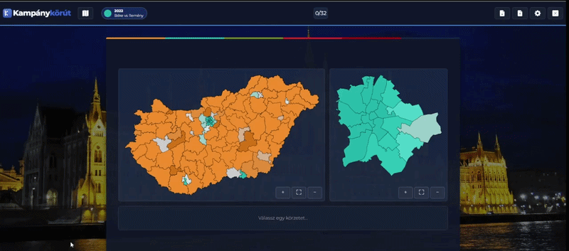

# Kampánykörút – Election Simulation Game

<p align="center">
  
</p>

An interactive election simulation game built with React and TypeScript. Players make strategic policy decisions that dynamically affect election results, candidate demographics, and party support across Hungarian electoral districts.

## 🗳️ Overview

**Kampánykörút** is a domain-driven, fully-typed election simulation game where:

- 🎯 Players make decisions during campaign turns
- ⚡ Each decision applies effects to electoral data (vote shares, candidate lists, demographics)
- 📊 Results are calculated in real-time using deterministic mandate algorithms

## 🛠️ Tech Stack

- ⚛️ **Frontend**: React 19.2 + TypeScript 5
- ⚡ **Build Tool**: Vite 7
- 🎨 **Styling**: Tailwind CSS 4
- 🧪 **Testing**: Vitest + @testing-library/react, Playwright (e2e & component tests)
- 📖 **Component Explorer**: Ladle
- 🧩 **State Management**: tsyringe (dependency injection)
- ✅ **Code Quality**: ESLint, Prettier, Husky

## 🔒 Core Invariants

The domain enforces strict constraints:

1. **Vote Preservation**: Vote shares must sum to 1.0
2. **Mass Conservation**: Effects must preserve total electoral mass
3. **Delta Equilibrium**: Vote redistribution must balance (DeltaSum ≈ 0)
4. **Domain Purity**: No React imports or side effects in `/domain`

## 🚀 Getting Started

### Prerequisites

- 🟢 Node.js 18+
- 📦 npm or yarn

### Installation

```bash
npm install
```

### Development

```bash
npm run dev
```

Starts Vite dev server with HMR at http://localhost:5173

### Build

```bash
npm run build
```

Compiles TypeScript and optimizes with Vite.

### Testing

```bash
npm run test           # Run unit tests (Vitest, watch mode)
npm run playwright      # Playwright e2e tests, UI mode
npm run playwright:ct   # Playwright component tests, UI mode
```

### Code Quality

```bash
npm run lint          # Check for linting issues
npm run lint:fix      # Auto-fix linting issues
npm run format        # Format code with Prettier
npm run format:check  # Check formatting without changes
```

### Component Explorer (Ladle)

```bash
npm run ladle  # Start Ladle dev server at http://localhost:6006
```

## 🎮 Game Mechanics

### Campaign Engine

The `CampaignEngine` orchestrates gameplay:

- 🕹️ Manages game state across turns
- ⚡ Applies player decisions to electoral data
- 🧮 Calculates mandate results after each decision
- 🔗 Integrates with effect systems and calculators

### Decision Effects

Player decisions trigger `RawEffect` objects that modify:

- 👤 **Candidate lists**: Demographics, qualifications, recognition
- 🏛️ **Party data**: Vote shares, supporter energy, momentum
- 🗺️ **Electoral dynamics**: Redistribution between parties and districts

### Result Calculation

The `MandateCalculator` converts vote shares to parliamentary seats using Hungarian electoral rules:

- ⚖️ Proportional representation system
- 📍 Single-mandate district voting
- 📋 Compensation list allocation

## 🏗️ Project Architecture

Following domain-driven design principles with strict separation of concerns:

```
src/
├── components/
│   ├── DistrictMap/         # SVG electoral map rendering (geometry, projection, coloring)
│   ├── loaders/             # react-router data loaders
│   └── ui/
│       ├── gameplay/        # In-game screens & chrome (GameChrome, TopBar, MapCreator, FinalResultScreen, ...)
│       ├── menu/            # Menu screens (MainMenu, SideSelectorMenu, SettingsMenu, ...)
│       └── icons/           # Icon registry
├── debug/                   # Runtime debug-mode toggle (window.debugMode)
├── di/                      # tsyringe container wiring
├── hooks/                   # Cross-cutting React hooks
├── logic/
│   ├── application/         # Orchestration: engines, hooks, navigation, DI factories
│   ├── i18n/                # i18next setup
│   ├── infra/                # External service clients (Supabase)
│   └── langs/               # Translation files (en, hu)
└── types/                    # App-local TypeScript types

shared/                       # Framework-agnostic package
├── domain/                   # Pure business logic (no React) — engines, transformers, mocks
├── types/                     # Domain TypeScript types + campaign configs
└── logger/                    # Logging utility

public/
├── assets/jsons/             # Global data shared across every campaign (game_modes.json, quotes.json)
└── campaigns/{route}/        # Per-campaign election data & content (see Data Formats below)
```

## 📁 Data Formats

Game data lives under two top-level folders in `public/`:

- 🗳️ `public/campaigns/{year_title}/` - election-year data (district results, configuration) plus, per party, the campaign content itself (questions, effects, strategies, advisor feedback)
- 🌐 `public/assets/jsons/` - global data shared across every campaign
- 🖼️ `public/assets/images/{year_title}` - images releated to the campaigns

### See [CAMPAIGN.md](CAMPAIGN.md) for the full file format documentation

### Internationalization

Supports multiple languages, located in `src/logic/langs/`:

- 🇬🇧 `en_lang.json` - English
- 🇭🇺 `hu_lang.json` - Hungarian

### Debug Mode

Campaigns with `isPublished: false` in `game_modes.json` are hidden from the campaign selector by default. Toggle visibility at runtime from the browser console:

```js
window.debugMode.enable();
```

## ⚡ Performance Considerations

- 🧠 Heavy components are memoized to prevent unnecessary re-renders
- 📦 Objects are created outside render functions when possible
- 🔑 Stable keys used in lists to optimize reconciliation
- 🎯 Domain logic executes synchronously for deterministic results

## 🧪 Testing Strategy

Every transformer and calculator includes tests for:

- ✅ Happy path (normal operation)
- ⚪ Zero-delta case (no effect)
- 🔍 Edge redistribution cases (boundary conditions)

## 🤝 Contributing

This project follows strict architectural guidelines:

- 🧬 Domain logic must remain pure and deterministic
- 🎨 UI components should not contain calculation logic
- 🔒 All game rules are enforced via domain invariants
- ✅ Tests should validate both happy paths and edge cases

## 📄 License

All rights reserved — see [LICENSE](LICENSE).
